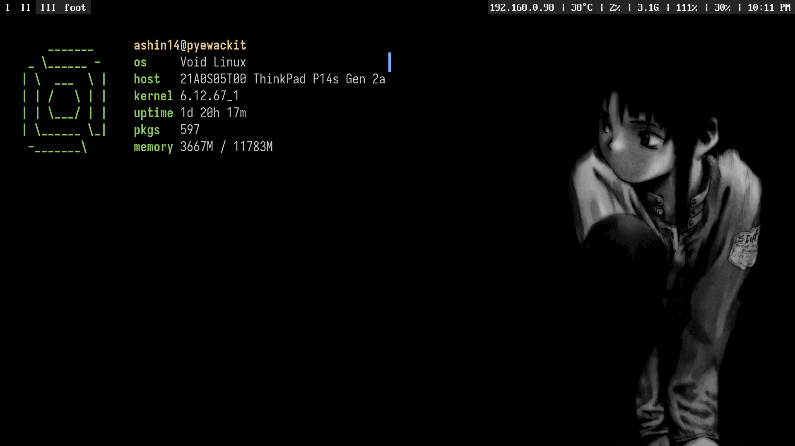

# trashban's dotfiles
## setup
* distro:       void linux
* compositor:   sway
* bar:          waybar
* launcher:     rofi
* notif:        mako
* editor:       vim/nvim

(note: this was updated at 01/02/26; i've probably already distrohopped...)

## installation
theres no installation script, but you can use `stow` and 'install' each compartment to the appropriate directory

## screenshots

