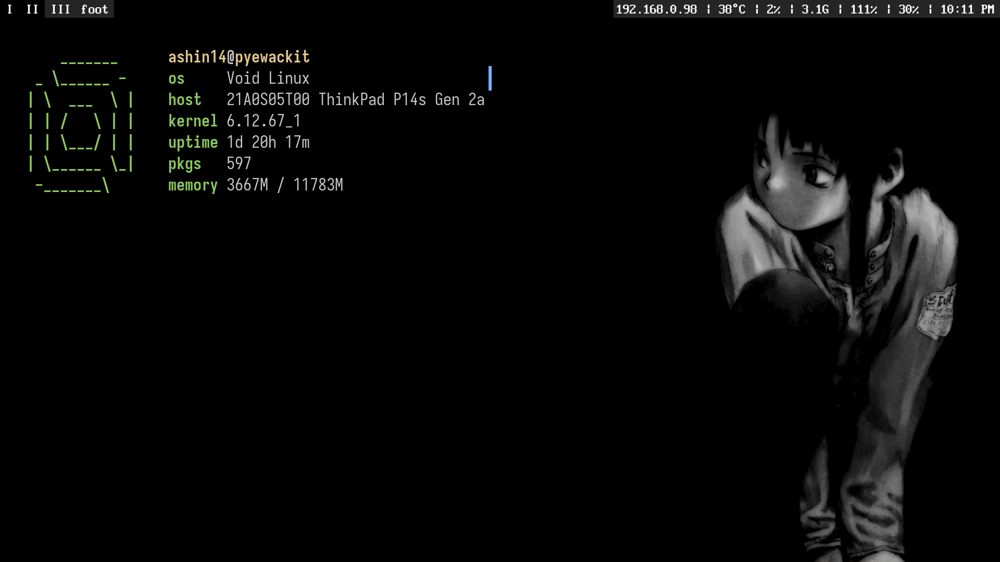

# my dotfiles

## current setup
* devices:		main pc/thinkpad-p14s
* distro:       gentoo/void
* compositor:   river/niri
* bar:          waybar
* launcher:     rofi
* notif:        mako
* editor:       nvim/vis (just for fun)

(note: this was updated at 05/05/26; its probably changed by now)

## installation
theres no installation script, but you can use `stow` to quickly symlink each conifg into its respective location

## screenshots

### main computer

### thinkpad-p14s

