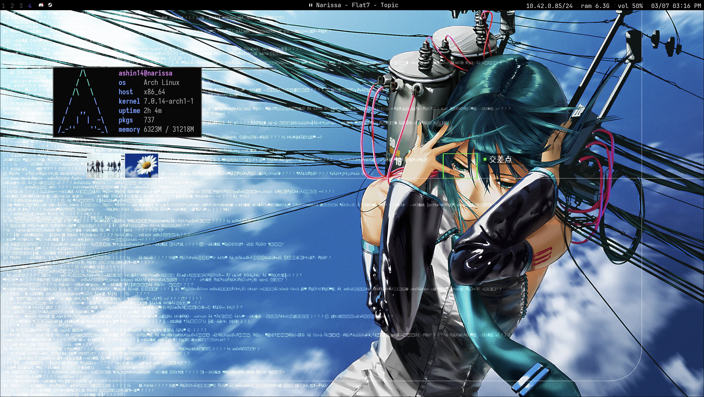

# dotfiles

## setup
* devices:		pc, thinkpad-p14s
* distro:       arch (rip gentoo/void)
* compositor:   hyprland
* bar:          waybar
* launcher:     rofi
* notif:        mako
* editor:       nvim

(note: this was last updated on 03/06/26; its probably changed by now)

## installation
no installation script, use `stow` to quickly symlink each conifg into its respective location

## screenshots

